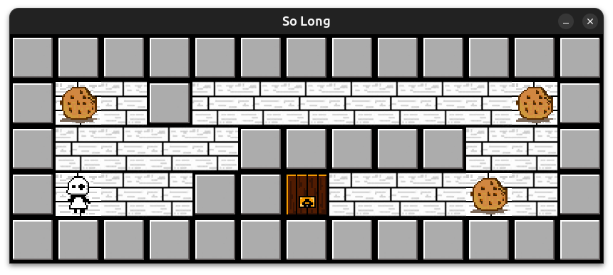
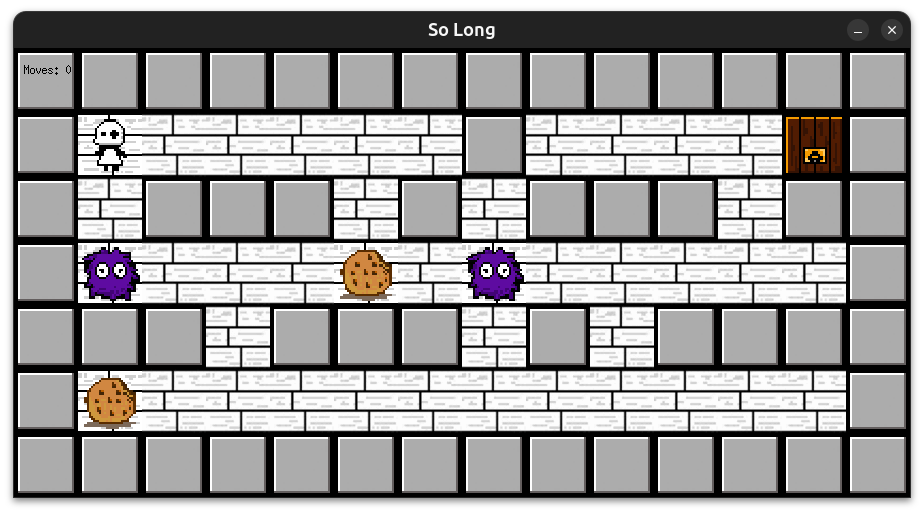
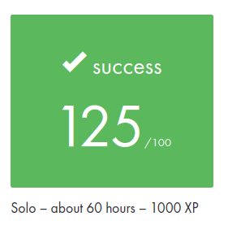

# 🕹️ so_long - A tiny 2D adventure



## ✨ What's this about?

**so_long** is a bite-sized 2D game built in pure C using the magical powers of **MiniLibX**.  
Your mission?  
🪙 Grab all the cookies, 🏃‍♂️ avoid enemies, and 🏁 find the exit... before rage quitting.

A classic project from 42 School to get hands-on with event-driven logic, basic rendering, and a touch of retro game dev vibes.

---

## ⚙️ Core Features

- 🖥️ Window creation & event hooks with MiniLibX
- 🕹️ Smooth keyboard controls (WASD & Arrow Keys)
- 🧩 Validated maps that guarantee a solvable level
- 🎨 Custom textures and pixel-perfect sprites
- 📊 Real-time move counter (for speedrunners, maybe?)
- 🗺️ Support for multiple custom maps via `.ber` files
- ❌ Safe and clean game exit (no memory leaks here!)

---

## 🎁 Bonus Mode (because why not?)



- ☠️ Enemies to keep you on your toes  
- 💥 Animated player sprite (now with extra personality)  
- 📟 HUD displaying your moves (because efficiency matters)

---

## 🛠️ Tools Used

- **C Language** with strict flags: `-Wall -Wextra -Werror`
- **MiniLibX** (42’s own graphics library)
- **libft** and **ft_printf** (custom-built utilities)

---

## 🐧 How to install it?

```bash
git clone https://github.com/your-username/so_long.git
cd so_long
make
```

## ▶️ How to play?

```bash
./solong <map.ber>
```

Where <map.ber> should look like a secret code made of:

    1 = Wall

    0 = Floor

    C = Collectible

    E = Exit

    P = Player

    (Bonus) A = Enemy

## 🎮 Controls

| 🎹 Key | 🏃 Action       |
|--------|-----------------|
| W 	 | Move up         |
| S 	 | Move down       |
| A 	 | Move left       |
| D      | Move right      |
| ESC    | Exit the game   |

---

## 🗂️ Project Structure (in simple words)
```bash
src/ 
├── main.c // The game starts here!
├── init_struct.c // creates and initialize all the structs of the game
├── check_map.c // Parse the map 
├── get_map.c // Copy the map into its structure 
├── flood_fill.c // checks for a valid path
├── exit_game.c // Cleans up and exits 
├── graphics.c // Loads and manage texture
├── move_player.c // Manage player moves
maps/ You can find all the maps here
bonus/
├── bonus_enemy.c // Manage enemy moves
├── bonus_player_animation.c // Manage player animation if all 4 directions
├── bonus_display_moves.c // Display moves on screen

```
---

## 🏆 My Scoreboard



---

## 🌱 What I learned along the way

- How to structure a real-time event loop  
- Map parsing with 2D arrays  
- Memory management when dealing with dynamic inputs  
- Basics of 2D rendering with MiniLibX  
- That game dev... even simple, can be addicting!

---

## 📜 License

Made with sweat and love as part of the **42 School** journey.

---

## 👾 About me

skayed - skayed@student.42roma.it

---

> “One more cookie... just one more...”